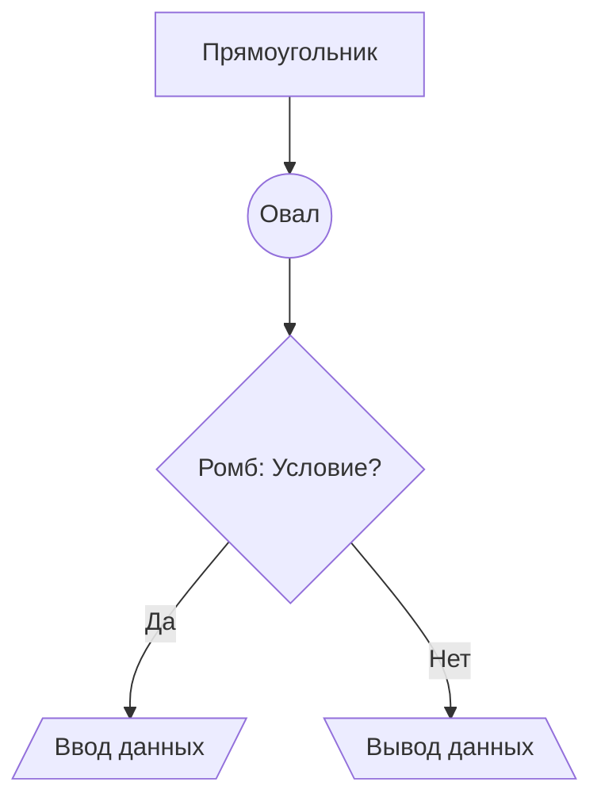
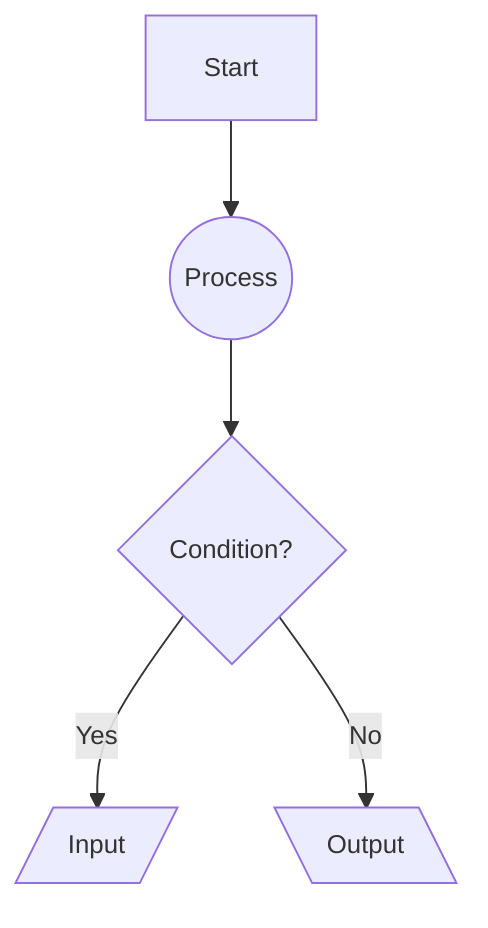
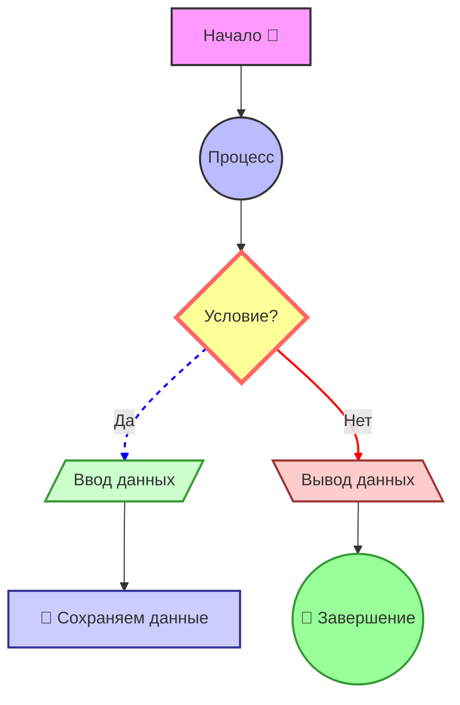

# walg_test

```mermaid
flowchart TD
  A[Прямоугольник] --> B((Овал))
  B --> C{Ромб: Условие?}
  C -->|Да| D[/Ввод данных/]
  C -->|Нет| E[\Вывод данных\]
```

```mermaid
flowchart TD
  A[<small>Start</small>] --> B((<small>Process</small>))
  B --> C{<small>Condition?</small>}
  C -->|<small>Yes</small>| D[/<small>Input</small>/]
  C -->|<small>No</small>| E[\<small>Output</small>\]
```

```mermaid
flowchart TD
  A[Начало 🚀] --> B((Процесс))
  B --> C{Условие?}
  C -- Да --> D[/Ввод данных/]
  C -- Нет --> E[\Вывод данных\]
  D --> F[🔵 Сохраняем данные]
  E --> G((🏁 Завершение))

  %% Стили для узлов
  style A fill:#f9f,stroke:#333,stroke-width:2px
  style B fill:#bbf,stroke:#333,stroke-width:2px
  style C fill:#ff9,stroke:#f66,stroke-width:4px
  style D fill:#cfc,stroke:#393,stroke-width:2px
  style E fill:#fcc,stroke:#933,stroke-width:2px
  style F fill:#ccf,stroke:#339,stroke-width:2px
  style G fill:#9f9,stroke:#393,stroke-width:2px

  %% Стили для стрелок
  linkStyle 2 stroke:blue,stroke-width:2px,stroke-dasharray: 5, 5
  linkStyle 3 stroke:red,stroke-width:2px
```
